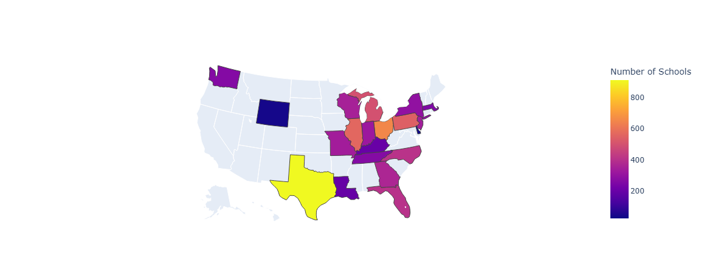
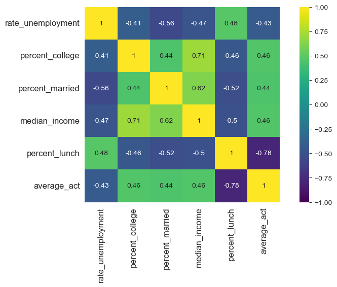
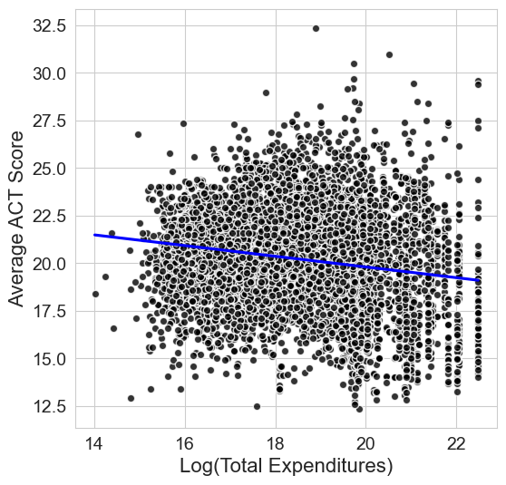

# Inequality in Educational Opportunity: Analyzing Socioeconomic Factors Affecting College Entrance Exam Scores

## Overview
This report addresses inequality of educational opportunity in U.S. high schools. Here we will focus on average student performance on the ACT or SAT exams that students take as part of the college application process. We will analyze data on average exam scores from various high schools across the country, along with socioceconomic indicators such as median household income, percentage of students eligible for free or reduced-price lunch, percentage of married parents and rate of unemployment. Later we will also consider school investment data and see if investment in schools can affect student performance on these exams.

We expect a range of school performance on these exams, but is school performance associated with socioeconomic factors?

Does school investment affect student performance?

## Analysis of Socioeconomic Factors and High School Students' ACT/SAT Scores (2016-2017)

 We will analyze data coverage and the relationship between average school performance on college entrance exams and our initial socioeconomic factors from Edgap.org which maps socioeconomic data with ACT/SAT scores. 

### Data Coverage

Our data from Edgap.org gathers information about schools from US Census Bureau across the United States. Based on our evaluation there is a significant number of states unreported with schools in the dataset. We can see that coverage is concentrated in the Midwest and some southern states, with large gaps in the west and some in the east. 

Below is a map showing states with data coverage for average exam scores for better understanding of state representation in our analysis.



***Figure 0: States with data coverage for average exam scores from Edgap.org. It covers mostly the Midwest.***

This indicates that our dataset may not be fully representative of the entire US, and we should be cautious when generalizing findings from this data.

### Socioeconomic Factors' Relationship with Exam Scores

We analyzed the relationships between average exam scores and socioeconomic factors. The correlation matrix below shows the strength of these relationships:



*Figure 1: Correlation matrix showing relationships between average exam scores and socioeconomic factors.*

The matrix reveals strong positive correlations between median household income (0.65), percentage of adults with college degrees, and percentage of married parents with average exam scores. Conversely, there are strong negative correlations between unemployment rate and percentage of students eligible for free or reduced-price lunch (-0.70) with exam scores. These results suggest that students from higher income families and those with more stable family structures tend to perform better on college entrance exams. 

Next, we will build a multilinear regression model to quantify the impact of these socioeconomic factors on average exam scores.

*** Note: We selected linear regression models based on the correlation patterns observed above. *** 

## Multilinear Regression Analysis and Modeling

We used Ordinary Least Squares (OLS) regression to model the relationship between average exam scores and socioeconomic factors. After initial exploration, we selected statistically significant predictors (p < 0.05): unemployment rate, percentage of adults with college degrees, and percentage of students eligible for free or reduced-price lunch. The regression results are summarized below:

<div style="font-size: 0.8em;">

```
R-squared: 0.628, MAE: 1.145

Variable              Coef      Std Err    t        P>|t|
Intercept            22.639     0.102     221.04   0.000
rate_unemployment    -2.175     0.374      -5.82   0.000
percent_college       1.716     0.127      13.53   0.000
percent_lunch        -7.588     0.092     -82.06   0.000
```

</div>

The model achieves an R-squared of 0.628, indicating that approximately 62.8% of the variance in average exam scores can be explained by these three socioeconomic factors. All predictors are statistically significant (p < 0.05), with unemployment rate and percentage of students on free/reduced lunch showing negative effects, while percentage of adults with college degrees shows a positive effect. The Mean Absolute Error (MAE) of 1.145 suggests that on average, our model's predictions are off by about 1.15 points on the exam score scale (typically ranging from 1 to 36 for ACT).

These results confirm our hypothesis that socioeconomic factors significantly influence educational outcomes as measured by college entrance exam scores.

Let's evaluate if school investment data impact ACT/SAT scores and if we can improve our model performance.


### Evaluating School Investment Impact on Exam Scores

We used school district expenditures from the National Center for Education Statistics (NCES) to evaluate if school investment impacts average exam scores. We will start the analysis by exploring relationships between school expenditure factors and average exam scores and perform regression analysis.


#### School District Expenditure Data Exploration and Regression Analysis on the Impact to Exam Scores

Our initial exploration of school district expenditure data shows large variation between different school districts, with extreme skew (mean around $365M, median around $62M, and outliers up to $5.8B). This is due to differences between large urban school districts (Chicago, New York, Los Angeles) and small rural school districts.

Surprisingly, raw total expenditure shows a negative correlation with average exam scores. The likely explanation is that data is skewed by large urban school districts with high expenditure but low average exam scores due to other socioeconomic factors like poverty and family instability. Additionally, district-level expenditure does not necessarily reflect per-school funding.

*** Note: Deeper analysis of urban vs rural school districts is outside the scope of this report. ***

Next, we will address the high skew in expenditure data by applying log transformation which is meant for that type of data distribution.

#### Log Transformation of School Expenditure Data

To address the extreme skew, we applied a log transformation to the total expenditure data, which is specifically designed for right-skewed distributions. The transformation successfully reduced skew and improved data normality.



***Figure 2: Regression plot showing much better concentration of data points after log transformation of total school district expenditure.***

With the log-transformed expenditure data, we can now evaluate how district expenditure affects our regression model performance by adding it as a predictor to our previous socioeconomic factors model.

#### Multilinear Regression Analysis and Modeling with District Expenditure

Ordinary Least Squares (OLS) regression results after adding log transformed total expenditure to our previous model are summarized below:

<div style="font-size: 0.8em;">

```
R-squared: 0.629, MAE: 1.143

Variable                  Coef      Std Err    t        P>|t|
Intercept                22.111     0.199     110.93   0.000
rate_unemployment        -2.333     0.377      -6.19   0.000
percent_college           1.549     0.138      11.23   0.000
percent_lunch            -7.708     0.100     -76.92   0.000
log_total_expenditures    0.038     0.012       3.09   0.002
```

</div>

From the result above we can see that district expenditure is statistically significant predictor (p < 0.05) with positive coefficient, indicating that higher school district expenditure is associated with higher average exam scores regardless previous regression slight negative correlation. It also improved our R-squared value to 0.629 from 0.628, and  the Mean Absolute Error (MAE) has marginally decreased to 1.143453.

It helps to confirm our hypothesis that school investment positively impacts student performance on college entrance exams, even when inital regression analysis showed negative correlation.

## Conclusion
In conclusion, our analysis demonstrates that socioeconomic factors such as unemployment rate, percentage of adults with college degrees, and percentage of students eligible for free or reduced-price lunch significantly influence average exam scores on college entrance exams. Additionally, school district expenditure also plays a role in enhancing student performance, but it would require per school level expenditure data for more accurate analysis.

## Data Sources and Methods

**Data Sources:**
- **[EdGap.org](https://edgap.org/)**: High school ACT/SAT exam scores and socioeconomic indicators (median household income, unemployment rate, percentage of adults with college degrees, percentage of married parents, percentage of students eligible for free/reduced lunch)
- **[NCES Common Core of Data](https://nces.ed.gov/ccd/pubschuniv.asp)**: School identifying information (location, type, enrollment)
- **[NCES School District Finance](https://nces.ed.gov/ccd/data_slfs.asp)**: District-level expenditure data

**Data Preparation:**
- Missing values (<0.04% in EdGap.org, <5% in NCES expenditure) were imputed using sklearn's IterativeImputer
- Schools with missing ACT/SAT scores were excluded
- District/school identifiers were standardized for merging
- Total expenditures were log-transformed to address extreme right skew
- Final dataset: 7,227 schools with complete data for analysis


